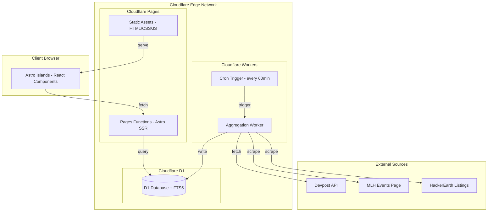
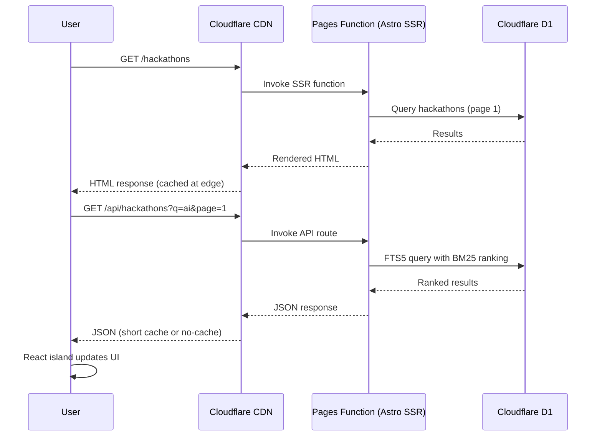
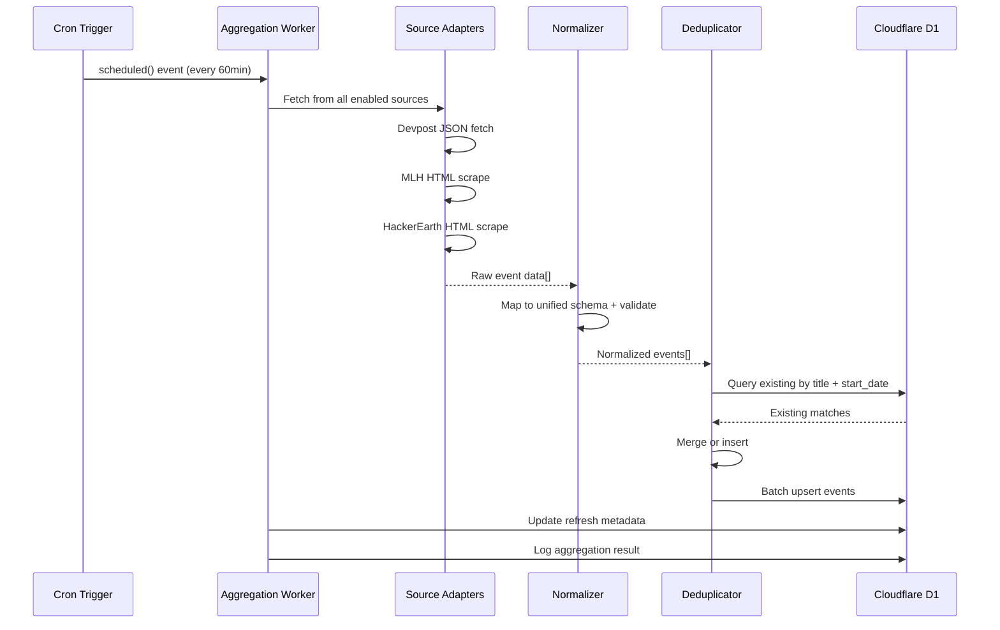

# Design Document: Hackathon Discovery Platform

## Overview

The Hackathon Discovery Platform is a self-hosted web application deployed on Cloudflare's edge network that aggregates hackathon events from multiple public sources (Devpost, MLH, HackerEarth) and presents them in a searchable, filterable interface. The platform uses Astro with the Cloudflare adapter for SSR/SSG pages (SEO), a reactive client-side UI for fast interactions, Cloudflare D1 for edge-native SQLite storage with FTS5 full-text search, and Cloudflare Cron Triggers for scheduled data aggregation.

### Key Design Decisions

| Decision | Choice | Rationale |
|----------|--------|-----------|
| Framework | Astro 4+ with `@astrojs/cloudflare` adapter | SSR/SSG for SEO (Req 8), island architecture for reactive UI (Req 6), direct D1 binding access, lightweight output, first-class Cloudflare integration |
| UI Islands | React (via `@astrojs/react`) | Interactive search/filter components as Astro islands; static content rendered as zero-JS HTML |
| API Layer | Astro API routes (running on Workers) | Co-located with pages, access same D1 binding, no separate service needed |
| Database | Cloudflare D1 (edge SQLite) | Serverless, zero-config, FTS5 support for search (Req 2), 5GB free storage, global reads |
| ORM | Drizzle ORM (D1 driver) | Lightweight, type-safe, first-class D1 support, no Prisma binary compatibility issues on Workers |
| Search | D1 FTS5 virtual table | Built-in to D1, supports BM25 ranking and substring matching (Req 2), no external search service |
| Styling | Tailwind CSS | Utility-first for responsive design (Req 6), fast iteration, small CSS output |
| Data Aggregation | Cloudflare Cron Triggers + separate Worker | Scheduled fetching every 60min, adapter pattern for sources, isolated from page-serving Worker |
| Hosting | Cloudflare Pages | Free unlimited static asset serving, git-based deploys, automatic HTTPS/TLS (Req 7) |
| TLS/HTTPS | Cloudflare (automatic) | Free universal SSL, HTTP→HTTPS redirect handled at CDN edge, no manual cert management (Req 7.3, 7.4) |
| Deployment | Wrangler CLI + GitHub integration | `wrangler pages deploy` or git push triggers; no Docker, no container registry |

### Research Findings

- **Cloudflare D1 + FTS5**: D1 supports FTS5 virtual tables for full-text search (must use lowercase `fts5` keyword). BM25 ranking and column weighting are available. Source: [Cloudflare D1 SQL Statements docs](https://developers.cloudflare.com/d1/sql-api/sql-statements/)
- **Astro + Cloudflare**: The `@astrojs/cloudflare` adapter deploys SSR routes as Pages Functions (Workers). D1 bindings are accessible via `context.locals.runtime.env.DB`. Source: [Cloudflare Pages - Astro guide](https://developers.cloudflare.com/pages/framework-guides/deploy-an-astro-site/)
- **Cron Triggers**: Workers can define `scheduled()` handlers invoked by cron expressions. Free tier supports up to 5 cron triggers per Worker. Testable locally via HTTP to `/cdn-cgi/handler/scheduled`. Source: [Cloudflare Cron Triggers docs](https://developers.cloudflare.com/workers/configuration/cron-triggers)
- **Devpost**: Exposes structured JSON data for hackathon listings (title, prizes, themes, deadlines). Available via scraping structured endpoints. Source: [Apify Devpost Scraper](https://apify.com/automation-lab/devpost-scraper)
- **MLH**: No official public API. Event data scraped from MLH events page (https://mlh.io/seasons/...). Open-source scrapers exist (e.g., [n3a9/mlh-events](https://github.com/n3a9/mlh-events)).
- **HackerEarth**: Challenge/hackathon listings available via HTML scraping with structured selectors.
- **Free Tier Limits**: Workers free plan gives 100k requests/day (10ms CPU/request). D1 free gives 5M rows read/day, 100k rows written/day, 5GB storage. Static asset requests (Pages) are free and unlimited.

### Architecture Trade-off: Why Astro over alternatives

| Option | Pros | Cons | Verdict |
|--------|------|------|---------|
| Next.js + `@cloudflare/next-on-pages` | Familiar React ecosystem | Many Next.js features unsupported on CF (middleware, ISR, image optimization); adapter is community-maintained; larger bundle | Rejected |
| React SPA (Vite) + Hono Workers | Clean separation, most CF-native | No SSR → poor SEO; would need prerendering layer | Rejected (SEO req) |
| **Astro + `@astrojs/cloudflare`** | SSR + SSG hybrid, island architecture, first-class CF support, lightweight, SEO-first | Less familiar than Next.js for some devs | **Selected** |

Astro wins because: SEO is a hard requirement (Req 8), its island architecture means interactive components (search, filters) get React while listing/detail pages ship zero JS by default, and the Cloudflare adapter is officially maintained.

## Architecture



### Request Flow



### Data Aggregation Flow



## Components and Interfaces

### Project Structure

```
hackathon-discovery-platform/
├── src/
│   ├── pages/              # Astro pages (SSR/SSG)
│   │   ├── index.astro
│   │   ├── hackathons/
│   │   │   ├── index.astro
│   │   │   └── [slug].astro
│   │   ├── api/
│   │   │   └── hackathons/
│   │   │       ├── index.ts    # GET /api/hackathons
│   │   │       └── [id].ts     # GET /api/hackathons/:id
│   │   └── sitemap.xml.ts
│   ├── components/         # React islands + Astro components
│   │   ├── SearchBar.tsx
│   │   ├── FilterPanel.tsx
│   │   ├── HackathonGrid.tsx
│   │   ├── HackathonCard.tsx
│   │   ├── LoadingSkeleton.astro
│   │   └── InfiniteScroll.tsx
│   ├── lib/
│   │   ├── db/
│   │   │   ├── schema.ts      # Drizzle schema
│   │   │   ├── queries.ts     # Typed query functions
│   │   │   └── migrations/    # D1 SQL migrations
│   │   ├── search.ts          # FTS5 search logic
│   │   ├── filters.ts         # Filter composition
│   │   └── types.ts           # Shared TypeScript types
│   └── layouts/
│       └── Base.astro
├── workers/
│   └── aggregator/
│       ├── index.ts            # scheduled() handler
│       ├── adapters/
│       │   ├── interface.ts
│       │   ├── devpost.ts
│       │   ├── mlh.ts
│       │   └── hackerearth.ts
│       ├── normalizer.ts
│       └── deduplicator.ts
├── astro.config.mjs
├── wrangler.toml               # Pages + D1 config
├── workers/aggregator/wrangler.toml  # Aggregation worker config
├── drizzle.config.ts
├── tailwind.config.mjs
└── package.json
```

### Source Adapter Interface

Each event source implements a common adapter interface:

```typescript
// workers/aggregator/adapters/interface.ts

interface EventSourceAdapter {
  readonly name: string;
  readonly enabled: boolean;

  fetch(): Promise<RawHackathonEvent[]>;
  healthCheck(): Promise<boolean>;
}

interface RawHackathonEvent {
  title: string;
  description?: string;
  startDate: string;        // ISO 8601
  endDate?: string;
  location?: string;
  organizer?: string;
  prizes?: string;
  tags?: string[];
  url: string;
  source: string;
}
```

### Data Normalizer

```typescript
// workers/aggregator/normalizer.ts

interface DataNormalizer {
  normalize(raw: RawHackathonEvent): NormalizedHackathon;
  validate(hackathon: NormalizedHackathon): ValidationResult;
}

interface NormalizedHackathon {
  title: string;            // max 200 chars
  description: string | null; // max 5000 chars
  startDate: string;        // ISO 8601
  endDate: string | null;
  location: string | null;
  format: 'virtual' | 'in_person' | 'hybrid';
  organizer: string | null;
  prizes: string | null;
  tags: string[];           // max 20 tags
  sourceUrl: string;
  sourceName: string;
}

interface ValidationResult {
  valid: boolean;
  errors: string[];
}
```

### Deduplication Engine

```typescript
// workers/aggregator/deduplicator.ts

interface DeduplicationEngine {
  findDuplicate(
    event: NormalizedHackathon,
    db: D1Database
  ): Promise<ExistingHackathon | null>;
  
  merge(
    existing: ExistingHackathon,
    incoming: NormalizedHackathon
  ): MergedHackathon;
}
```

### Search Engine Interface

```typescript
// src/lib/search.ts

interface SearchEngine {
  search(
    db: D1Database,
    query: string,
    filters: FilterCriteria,
    pagination: PaginationParams
  ): Promise<SearchResult>;
}

interface FilterCriteria {
  dateRange?: { start: string; end: string };
  format?: ('virtual' | 'in_person' | 'hybrid')[];
  tags?: string[];
}

interface PaginationParams {
  page: number;
  pageSize: number;         // default 12
}

interface SearchResult {
  hackathons: HackathonSummary[];
  total: number;
  page: number;
  pageSize: number;
  hasMore: boolean;
}
```

### API Routes

| Endpoint | Method | Description | Query Params |
|----------|--------|-------------|--------------|
| `/api/hackathons` | GET | List/search hackathons | `q`, `page`, `pageSize`, `format`, `tags`, `dateStart`, `dateEnd` |
| `/api/hackathons/[id]` | GET | Get hackathon detail | — |
| `/api/health` | GET | Health check (D1 connectivity) | — |

### Pages (Astro SSR)

| Route | Rendering | Description |
|-------|-----------|-------------|
| `/` | SSR (cached) | Landing page with featured hackathons |
| `/hackathons` | SSR | Main listing with search/filter |
| `/hackathons/[slug]` | SSR | Hackathon detail page |
| `/sitemap.xml` | Dynamic (SSR) | Generated sitemap |

### UI Component Hierarchy

```
Base Layout (Astro)
├── Header (Astro - static HTML, nav, branding)
├── SearchBar (React island - client:load)
├── FilterPanel (React island - client:visible)
│   ├── DateRangeFilter
│   ├── FormatFilter
│   └── TagFilter
├── HackathonGrid (React island - client:load)
│   ├── HackathonCard[]
│   ├── LoadingSkeleton
│   └── InfiniteScrollTrigger
├── ResultsCount
└── Footer (Astro - static HTML)
```

### Wrangler Configuration

```toml
# wrangler.toml (Pages project)
name = "hackathon-discovery"
compatibility_date = "2024-09-23"

[[d1_databases]]
binding = "DB"
database_name = "hackathon-discovery-db"
database_id = "<your-d1-database-id>"
```

```toml
# workers/aggregator/wrangler.toml
name = "hackathon-aggregator"
main = "index.ts"
compatibility_date = "2024-09-23"

[[d1_databases]]
binding = "DB"
database_name = "hackathon-discovery-db"
database_id = "<your-d1-database-id>"

[triggers]
crons = ["0 * * * *"]  # Every hour (configurable)

[vars]
REFRESH_INTERVAL_MINUTES = "60"
SOURCE_DEVPOST_ENABLED = "true"
SOURCE_MLH_ENABLED = "true"
SOURCE_HACKEREARTH_ENABLED = "true"
```

## Data Models

### Drizzle Schema (D1)

```typescript
// src/lib/db/schema.ts
import { sqliteTable, text, integer, uniqueIndex, index } from 'drizzle-orm/sqlite-core';

export const hackathons = sqliteTable('hackathons', {
  id: text('id').primaryKey(),           // cuid or nanoid
  slug: text('slug').notNull().unique(),
  title: text('title').notNull(),
  description: text('description'),
  startDate: text('start_date').notNull(),  // ISO 8601 string
  endDate: text('end_date'),
  location: text('location'),
  format: text('format', { enum: ['virtual', 'in_person', 'hybrid'] })
    .notNull()
    .default('virtual'),
  organizer: text('organizer'),
  prizes: text('prizes'),
  sourceUrl: text('source_url').notNull(),
  sources: text('sources').notNull(),       // JSON array of source names
  tags: text('tags').notNull().default('[]'), // JSON array of tag strings
  createdAt: text('created_at').notNull(),  // ISO 8601
  updatedAt: text('updated_at').notNull(),
  lastSeenAt: text('last_seen_at').notNull(),
}, (table) => ({
  startDateIdx: index('idx_start_date').on(table.startDate),
  formatIdx: index('idx_format').on(table.format),
  deduplicationKey: uniqueIndex('idx_dedup').on(table.title, table.startDate),
}));

export const aggregationLogs = sqliteTable('aggregation_logs', {
  id: text('id').primaryKey(),
  timestamp: text('timestamp').notNull(),
  sourceName: text('source_name').notNull(),
  status: text('status', { enum: ['success', 'partial_failure', 'failure'] }).notNull(),
  eventsFound: integer('events_found').notNull().default(0),
  eventsCreated: integer('events_created').notNull().default(0),
  eventsUpdated: integer('events_updated').notNull().default(0),
  errorMessage: text('error_message'),
  errorType: text('error_type'),
  durationMs: integer('duration_ms').notNull(),
});

export const refreshMetadata = sqliteTable('refresh_metadata', {
  id: text('id').primaryKey().default('singleton'),
  lastRefreshAt: text('last_refresh_at').notNull(),
  nextRefreshAt: text('next_refresh_at').notNull(),
  intervalMinutes: integer('interval_minutes').notNull().default(60),
  allSourcesFailed: integer('all_sources_failed', { mode: 'boolean' }).notNull().default(false),
});
```

### D1 Migration: FTS5 Virtual Table

```sql
-- migrations/0001_create_tables.sql

CREATE TABLE IF NOT EXISTS hackathons (
  id TEXT PRIMARY KEY,
  slug TEXT NOT NULL UNIQUE,
  title TEXT NOT NULL,
  description TEXT,
  start_date TEXT NOT NULL,
  end_date TEXT,
  location TEXT,
  format TEXT NOT NULL DEFAULT 'virtual',
  organizer TEXT,
  prizes TEXT,
  source_url TEXT NOT NULL,
  sources TEXT NOT NULL DEFAULT '[]',
  tags TEXT NOT NULL DEFAULT '[]',
  created_at TEXT NOT NULL,
  updated_at TEXT NOT NULL,
  last_seen_at TEXT NOT NULL
);

CREATE UNIQUE INDEX IF NOT EXISTS idx_dedup ON hackathons(title, start_date);
CREATE INDEX IF NOT EXISTS idx_start_date ON hackathons(start_date);
CREATE INDEX IF NOT EXISTS idx_format ON hackathons(format);

-- FTS5 virtual table for full-text search (D1 requires lowercase 'fts5')
CREATE VIRTUAL TABLE IF NOT EXISTS hackathon_fts USING fts5(
  title,
  description,
  tags,
  content='hackathons',
  content_rowid='rowid',
  tokenize='porter unicode61'
);

-- Triggers to keep FTS5 index in sync
CREATE TRIGGER IF NOT EXISTS hackathon_fts_insert AFTER INSERT ON hackathons BEGIN
  INSERT INTO hackathon_fts(rowid, title, description, tags)
  VALUES (new.rowid, new.title, new.description, new.tags);
END;

CREATE TRIGGER IF NOT EXISTS hackathon_fts_delete AFTER DELETE ON hackathons BEGIN
  INSERT INTO hackathon_fts(hackathon_fts, rowid, title, description, tags)
  VALUES ('delete', old.rowid, old.title, old.description, old.tags);
END;

CREATE TRIGGER IF NOT EXISTS hackathon_fts_update AFTER UPDATE ON hackathons BEGIN
  INSERT INTO hackathon_fts(hackathon_fts, rowid, title, description, tags)
  VALUES ('delete', old.rowid, old.title, old.description, old.tags);
  INSERT INTO hackathon_fts(rowid, title, description, tags)
  VALUES (new.rowid, new.title, new.description, new.tags);
END;

-- Aggregation logging
CREATE TABLE IF NOT EXISTS aggregation_logs (
  id TEXT PRIMARY KEY,
  timestamp TEXT NOT NULL,
  source_name TEXT NOT NULL,
  status TEXT NOT NULL,
  events_found INTEGER NOT NULL DEFAULT 0,
  events_created INTEGER NOT NULL DEFAULT 0,
  events_updated INTEGER NOT NULL DEFAULT 0,
  error_message TEXT,
  error_type TEXT,
  duration_ms INTEGER NOT NULL
);

-- Refresh state tracking
CREATE TABLE IF NOT EXISTS refresh_metadata (
  id TEXT PRIMARY KEY DEFAULT 'singleton',
  last_refresh_at TEXT NOT NULL,
  next_refresh_at TEXT NOT NULL,
  interval_minutes INTEGER NOT NULL DEFAULT 60,
  all_sources_failed INTEGER NOT NULL DEFAULT 0
);
```

### FTS5 Search Query

Search ranking uses FTS5's `bm25()` function with column weights to satisfy Requirement 2.3's priority ordering (title > tags > description):

```typescript
// src/lib/search.ts

export function buildSearchQuery(query: string): string {
  // BM25 weights: title=10, description=1, tags=5
  // Column order in FTS5 table: title(0), description(1), tags(2)
  return `
    SELECT h.*, 
           bm25(hackathon_fts, 10.0, 1.0, 5.0) AS rank
    FROM hackathon_fts fts
    JOIN hackathons h ON h.rowid = fts.rowid
    WHERE hackathon_fts MATCH ?
    ORDER BY rank
  `;
}
```

### API Response Shapes

```typescript
// GET /api/hackathons response
interface HackathonListResponse {
  data: HackathonSummary[];
  meta: {
    total: number;
    page: number;
    pageSize: number;
    hasMore: boolean;
  };
}

interface HackathonSummary {
  id: string;
  slug: string;
  title: string;           // truncated to 80 chars for card display
  startDate: string;       // ISO 8601
  endDate: string | null;
  format: 'virtual' | 'in_person' | 'hybrid';
  tags: string[];          // max 3 primary tags for card
  organizer: string | null;
}

// GET /api/hackathons/[id] response
interface HackathonDetailResponse {
  data: {
    id: string;
    slug: string;
    title: string;
    description: string | null;
    startDate: string;
    endDate: string | null;
    location: string | null;
    format: 'virtual' | 'in_person' | 'hybrid';
    organizer: string | null;
    prizes: string | null;
    tags: string[];
    sourceUrl: string;
    sources: string[];
    updatedAt: string;
  };
}
```

### Environment & Bindings

```typescript
// src/env.d.ts (Astro environment types)
interface Env {
  DB: D1Database;
}

// Accessed in Astro pages/API routes:
// const db = Astro.locals.runtime.env.DB;
```

```typescript
// workers/aggregator environment
interface AggregatorEnv {
  DB: D1Database;
  REFRESH_INTERVAL_MINUTES: string;
  SOURCE_DEVPOST_ENABLED: string;
  SOURCE_MLH_ENABLED: string;
  SOURCE_HACKEREARTH_ENABLED: string;
}
```

### Cloudflare Free Tier Constraints

| Resource | Free Limit | Expected Usage | Headroom |
|----------|-----------|----------------|----------|
| Worker requests/day | 100,000 | ~1,000-5,000 (portfolio traffic) | 20-100x |
| Worker CPU time | 10ms/request | ~2-5ms (D1 query + render) | 2-5x |
| D1 rows read/day | 5,000,000 | ~50,000 (search + listing) | 100x |
| D1 rows written/day | 100,000 | ~500 (hourly aggregation) | 200x |
| D1 storage | 5 GB | ~50 MB (hackathon data) | 100x |
| Static assets | Unlimited | Unlimited | ∞ |
| Cron triggers | 5 per Worker | 1 (hourly aggregation) | 5x |


## Correctness Properties

*A property is a characteristic or behavior that should hold true across all valid executions of a system — essentially, a formal statement about what the system should do. Properties serve as the bridge between human-readable specifications and machine-verifiable correctness guarantees.*

### Property 1: Normalization schema conformance

*For any* raw hackathon event from any source adapter (with arbitrary field lengths and content), the normalization function SHALL produce an output where title is at most 200 characters, description is at most 5000 characters, tags contains at most 20 entries, and all required fields (title, startDate, sourceUrl) are present and non-empty.

**Validates: Requirements 1.2**

### Property 2: Refresh interval validation

*For any* integer value provided as the refresh interval configuration, the system SHALL accept the value if and only if it is greater than or equal to 15 minutes, and SHALL reject values below 15 with a validation error.

**Validates: Requirements 1.3**

### Property 3: Resilient partial-failure fetching

*For any* non-empty subset of event sources that return errors (while at least one source remains healthy), the aggregator SHALL still successfully fetch and store data from the remaining non-failing sources, and each failure SHALL produce a log entry containing source name, timestamp, and error type.

**Validates: Requirements 1.4, 1.7**

### Property 4: Cache staleness calculation

*For any* combination of (lastRefreshTimestamp, intervalMinutes, currentTime), cached data SHALL be considered stale if and only if currentTime exceeds lastRefreshTimestamp + (2 × intervalMinutes).

**Validates: Requirements 1.5**

### Property 5: Deduplication merge correctness

*For any* two hackathon events with the same title (case-insensitive) and same start date originating from different Event_Sources, the deduplication engine SHALL produce exactly one merged record that preserves information from both sources rather than creating two separate records.

**Validates: Requirements 1.6**

### Property 6: Search substring matching

*For any* search query of 2 or more characters (up to 200 characters) and any hackathon dataset, every hackathon in the search results SHALL contain the query as a case-insensitive substring in at least one of: title, description, or tags.

**Validates: Requirements 2.1**

### Property 7: Short query returns full dataset

*For any* search query with fewer than 2 characters (including empty string) and any hackathon dataset, the result set SHALL equal the complete unfiltered dataset.

**Validates: Requirements 2.2**

### Property 8: Search ranking priority

*For any* search query that matches multiple hackathons, hackathons matched by title SHALL appear before hackathons matched only by tags, which SHALL appear before hackathons matched only by description.

**Validates: Requirements 2.3**

### Property 9: Filter AND/OR logic

*For any* combination of filters (date range, format, tags) applied to any hackathon dataset, every hackathon in the filtered results SHALL satisfy ALL filter types simultaneously (AND across types), and within each filter type, the hackathon SHALL match at least one selected value (OR within type).

**Validates: Requirements 3.2**

### Property 10: Search and filter composition

*For any* search query combined with any set of filters applied to any dataset, the result set SHALL equal the intersection of the search-only result set and the filter-only result set.

**Validates: Requirements 3.3**

### Property 11: Filter reset restores full dataset

*For any* dataset and any previously applied combination of filters and search, clearing all filters and search SHALL produce a result set equal to the complete dataset.

**Validates: Requirements 3.4**

### Property 12: Invalid date range rejection

*For any* custom date range where the start date is strictly after the end date, the filter validation SHALL reject the input and return a validation error without modifying the displayed results.

**Validates: Requirements 3.5**

### Property 13: Card display truncation rules

*For any* hackathon with arbitrary title length and tag count, the rendered Hackathon_Card SHALL display the title truncated to at most 80 characters (with ellipsis appended if the original exceeds 80 characters), and at most 3 tags.

**Validates: Requirements 4.2**

### Property 14: Result count consistency

*For any* search/filter combination applied to any dataset, the reported total count in the API response SHALL equal the actual number of hackathons matching those criteria in the database.

**Validates: Requirements 4.4**

### Property 15: Permalink round-trip

*For any* hackathon stored in the system, generating its detail page permalink (based on slug) and querying that slug SHALL resolve to the same hackathon's data with matching id, title, and content.

**Validates: Requirements 5.3**

### Property 16: Error response information containment

*For any* unhandled server error (regardless of error type, message content, or origin), the error response SHALL return a 500 status code and the response body SHALL NOT contain stack traces, internal file paths, environment variable values, D1 connection strings, or Cloudflare Worker internals.

**Validates: Requirements 7.5**

### Property 17: Meta tag completeness on detail pages

*For any* hackathon detail page rendered with valid hackathon data, the HTML output SHALL contain og:title, og:description, og:url, twitter:card, and twitter:title meta tags each with non-empty values derived from the hackathon content, plus a canonical URL meta tag matching the page's permanent URL.

**Validates: Requirements 8.2, 8.5**

### Property 18: Sitemap completeness

*For any* set of published hackathons currently stored in D1, the generated sitemap.xml SHALL contain exactly the detail page URLs for all currently published hackathons and no URLs for hackathons that have been removed.

**Validates: Requirements 8.3**

## Error Handling

### Source Adapter Errors (Aggregation Worker)

| Scenario | Handling | User Impact |
|----------|----------|-------------|
| Single source timeout (>10s) | Log failure with source name + error type, continue with other sources | None — D1 still has cached data |
| Single source returns malformed data | Skip malformed entries, log warning per entry | Possibly fewer events until next refresh |
| All sources fail | Log aggregation failure event (all_sources_failed=true), preserve existing D1 data | None immediately; visible in aggregation_logs |
| Source rate-limited (429) | Log and skip source for this cycle, retry next scheduled run | Slight delay in new data from that source |

### Worker/Pages Function Errors

| Scenario | Handling | Response |
|----------|----------|----------|
| Search query too long (>200 chars) | Reject with 400 | `{ error: "Query exceeds maximum length of 200 characters" }` |
| Invalid filter parameters | Reject with 400 | `{ error: "Invalid filter", details: [...] }` |
| D1 query failure | Catch, return 503 | Generic error page: "Something went wrong. Please try again." |
| Unhandled exception | Worker error handler returns 500 | Generic error page (no internals exposed per Property 16) |
| Hackathon slug not found | Return 404 | Not-found page with navigation back to listing |
| Worker request limit exceeded (100k/day) | Cloudflare returns 429 automatically | N/A — Cloudflare handles; static assets still served |

### Client-Side Error States

| Scenario | UI Behavior |
|----------|-------------|
| API fetch timeout (>10s) | Replace skeletons with error message + retry button |
| Network error during infinite scroll | Show inline error at bottom of list + retry |
| Search API unavailable | Show "search temporarily unavailable" banner + retry |
| Empty results (search/filter) | Show friendly "no results" message + suggestion to broaden search |
| 429 rate limit from Worker | Show "service busy, please try again shortly" |

### Retry Strategy

- **Client retries**: Exponential backoff (1s, 2s, 4s) with max 3 retries on network/5xx failures
- **Aggregation Worker retries**: Single retry per source with 10s timeout during scheduled run
- **No retry**: On 4xx client errors (invalid input) or 429 from Cloudflare (daily limit)

### Cloudflare-Specific Considerations

- **Worker CPU limit (10ms free tier)**: Keep D1 queries simple; avoid complex joins. If queries approach CPU limit, consider pre-computing search results.
- **D1 write limits (100k rows/day)**: Hourly aggregation writing ~50-100 rows per run is well within limits.
- **Cold starts**: Workers have near-zero cold start. Pages Functions may have ~5-50ms initialization.
- **Request size**: Workers limit request/response body to 100MB (free tier). Hackathon API responses are well under this.

## Testing Strategy

### Unit Tests

Unit tests cover specific examples, edge cases, and component behavior. Framework: **Vitest** (fast, native ESM, works with Cloudflare Workers via `@cloudflare/vitest-pool-workers`).

- **Normalizer**: Test with representative raw data from each source format; boundary lengths (200/201 char titles, 5000/5001 char descriptions, 20/21 tags)
- **Deduplicator**: Test merge logic with specific duplicate scenarios (same title+date, different sources)
- **Filter logic**: Test each filter type individually (date range, format, tags) with known data
- **Date validation**: Test boundary conditions (same day, one day apart, start=end)
- **Card rendering**: Test truncation with exact boundary lengths (79, 80, 81 chars for title; 2, 3, 4 tags)
- **Slug generation**: Test with special characters, Unicode, potential collisions
- **Error responses**: Test that no internals leak in error scenarios (stack traces, file paths)
- **Search query building**: Test FTS5 query construction and BM25 weight application
- **Sitemap generation**: Test with known set of hackathons, verify URL correctness
- **Meta tag rendering**: Test with hackathon data containing special characters, long descriptions

### Property-Based Tests

Property-based tests verify universal correctness across generated inputs. Using **fast-check** as the PBT library for TypeScript.

**Configuration:**
- Minimum 100 iterations per property test
- Each test tagged with its design property reference
- Run with `vitest --run` (no watch mode)

**Properties to implement:**

| Property | Tag | Key Generator |
|----------|-----|---------------|
| 1: Schema conformance | `Feature: hackathon-discovery-platform, Property 1: Normalization schema conformance` | Random RawHackathonEvent with variable field lengths (0-500 char titles, 0-10000 char descriptions, 0-50 tags) |
| 2: Interval validation | `Feature: hackathon-discovery-platform, Property 2: Refresh interval validation` | Random integers (0-1440) |
| 3: Partial-failure resilience | `Feature: hackathon-discovery-platform, Property 3: Resilient partial-failure fetching` | Random non-empty subsets of failing adapters (keeping at least one healthy) |
| 4: Cache staleness | `Feature: hackathon-discovery-platform, Property 4: Cache staleness calculation` | Random (timestamp, interval>=15, now) tuples |
| 5: Deduplication | `Feature: hackathon-discovery-platform, Property 5: Deduplication merge correctness` | Pairs of events with matching title+startDate from different sources |
| 6: Search substring | `Feature: hackathon-discovery-platform, Property 6: Search substring matching` | Random queries (2-200 chars) + random hackathon datasets |
| 7: Short query | `Feature: hackathon-discovery-platform, Property 7: Short query returns full dataset` | Random 0-1 char strings + random hackathon datasets |
| 8: Ranking | `Feature: hackathon-discovery-platform, Property 8: Search ranking priority` | Datasets with controlled match locations (title-only, tag-only, desc-only) |
| 9: Filter logic | `Feature: hackathon-discovery-platform, Property 9: Filter AND/OR logic` | Random filter combinations + random hackathon datasets |
| 10: Composition | `Feature: hackathon-discovery-platform, Property 10: Search and filter composition` | Random queries + filters + datasets |
| 11: Reset | `Feature: hackathon-discovery-platform, Property 11: Filter reset restores full dataset` | Random datasets with random prior filter state |
| 12: Date validation | `Feature: hackathon-discovery-platform, Property 12: Invalid date range rejection` | Random date pairs (both valid and invalid orderings) |
| 13: Truncation | `Feature: hackathon-discovery-platform, Property 13: Card display truncation rules` | Random hackathons with title lengths 0-300 and tag counts 0-20 |
| 14: Count | `Feature: hackathon-discovery-platform, Property 14: Result count consistency` | Random queries/filters + datasets |
| 15: Permalink | `Feature: hackathon-discovery-platform, Property 15: Permalink round-trip` | Random hackathon slugs and data |
| 16: Error containment | `Feature: hackathon-discovery-platform, Property 16: Error response information containment` | Random error types, messages containing file paths, stack traces, env vars |
| 17: Meta tags | `Feature: hackathon-discovery-platform, Property 17: Meta tag completeness on detail pages` | Random hackathon data (varying title/description lengths, special chars) |
| 18: Sitemap | `Feature: hackathon-discovery-platform, Property 18: Sitemap completeness` | Random sets of published/removed hackathons |

### Integration Tests

Using `@cloudflare/vitest-pool-workers` for local D1 integration testing:

- D1 migrations apply cleanly and FTS5 table is created
- FTS5 triggers sync data correctly on insert/update/delete
- Search query returns correctly ranked results from D1
- Aggregation Worker's `scheduled()` handler completes successfully with mock sources
- Deduplication correctly merges records in D1
- API routes return correct response shapes
- SSR pages render complete HTML with meta tags
- Sitemap.xml contains correct URLs from D1 data
- Wrangler dev serves pages correctly locally

### E2E Tests (Playwright)

Run against deployed preview environment or `wrangler pages dev`:

- User can search and see results update reactively (React islands)
- User can apply filters and see correct narrowing
- User can click a card and navigate to the detail page
- Permalink navigation works from a cold start (direct URL access)
- Mobile viewport (320px) shows single-column layout
- Desktop viewport (1200px) shows multi-column grid
- Skeleton loading states appear and resolve
- Infinite scroll loads next batch
- "No results" state displays correctly
- Meta tags are present in page source (curl/fetch, not browser-rendered)

### Deployment Verification

- `wrangler pages deploy` succeeds
- Custom domain resolves with HTTPS
- HTTP requests redirect to HTTPS (Cloudflare setting)
- D1 database is accessible from Pages Functions
- Cron Trigger fires and aggregation Worker executes
- Static assets served from Cloudflare CDN (check response headers)
- Lighthouse CI score >= 80 on mobile
